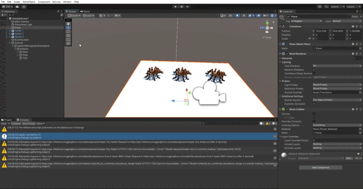

# Práctica Reconocimiento del habla

A continuación se muestra un GIF del funcionamiento de la práctica.
Se han implementado dos comandos:
- Jump: La araña hace un salto.
- Flip: La araña hace una voltereta.

[Raycast.cs](scripts/Raycast.cs)

[SpeechRecognitionExample.cs](scripts/SpeechRecognitionExample.cs)